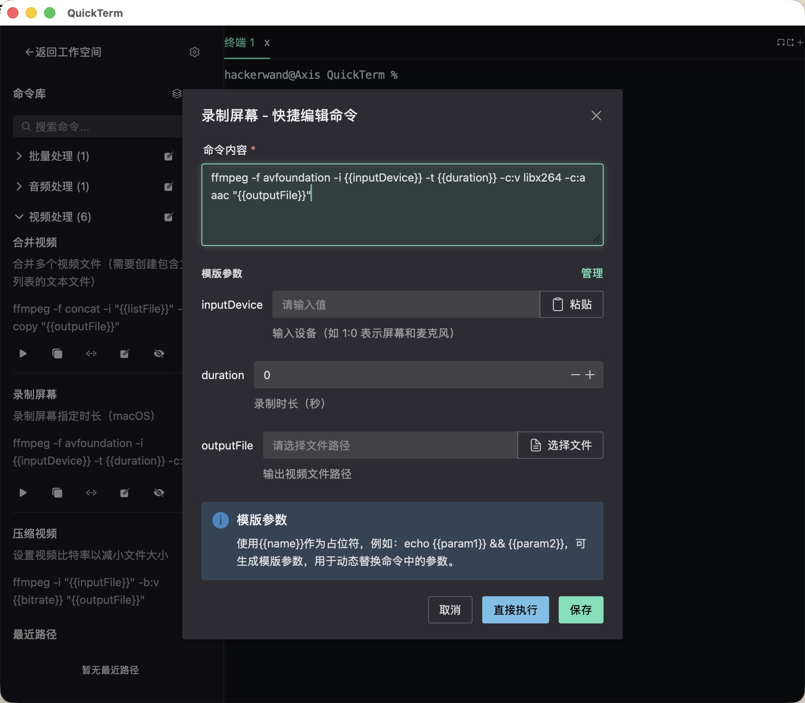
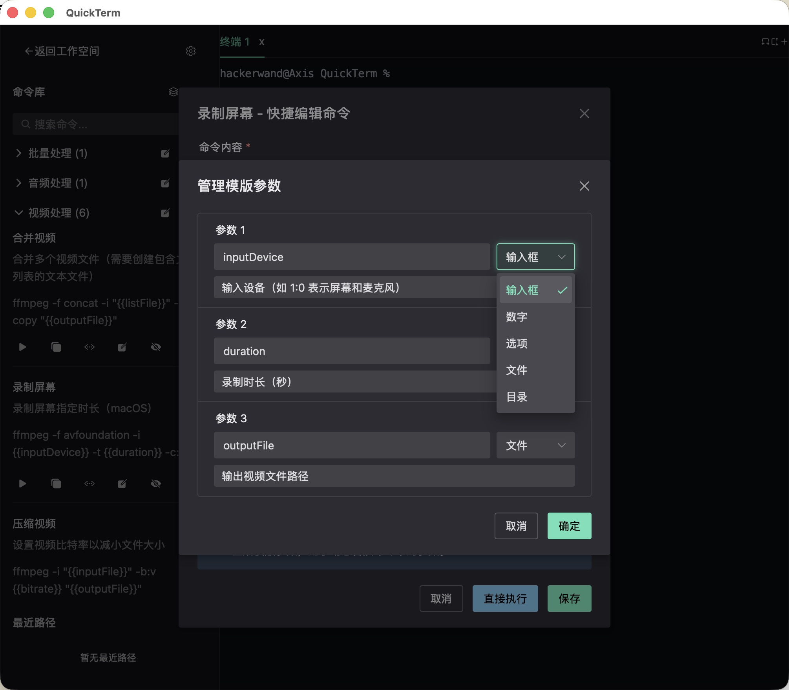
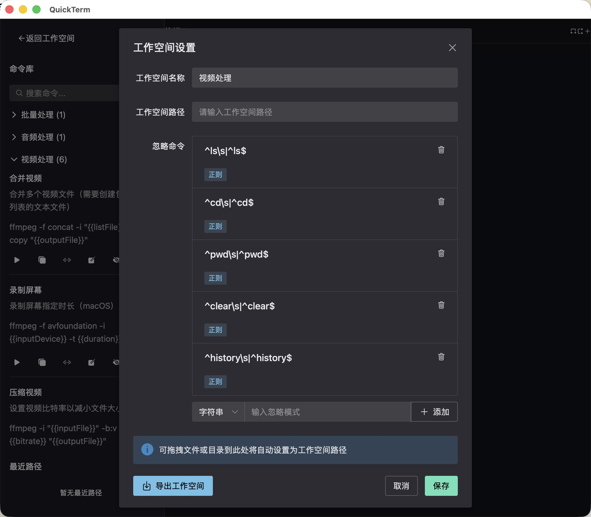
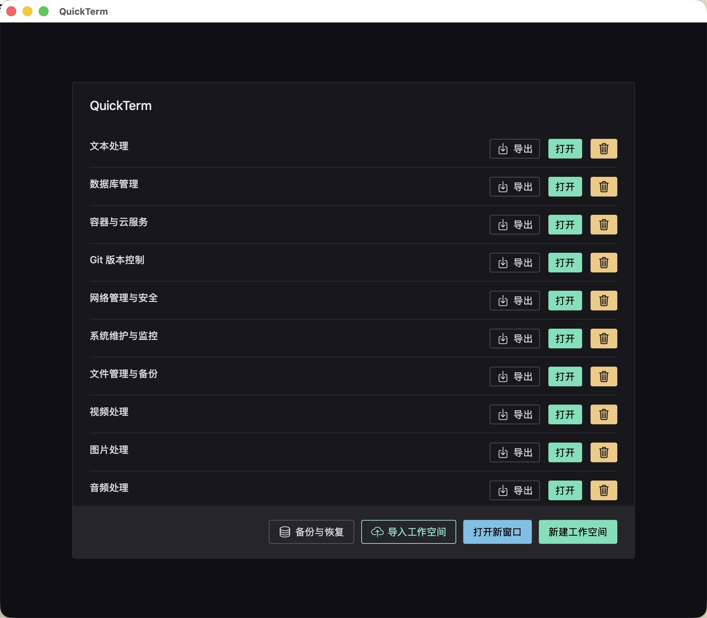
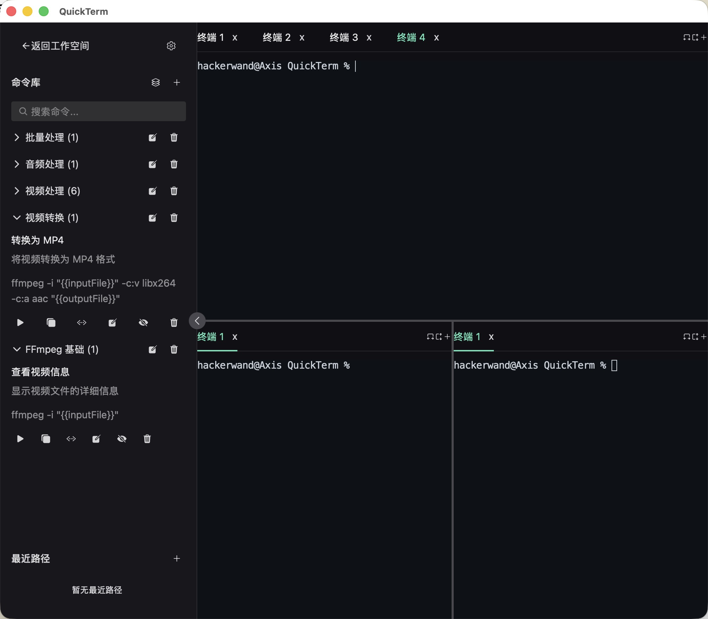
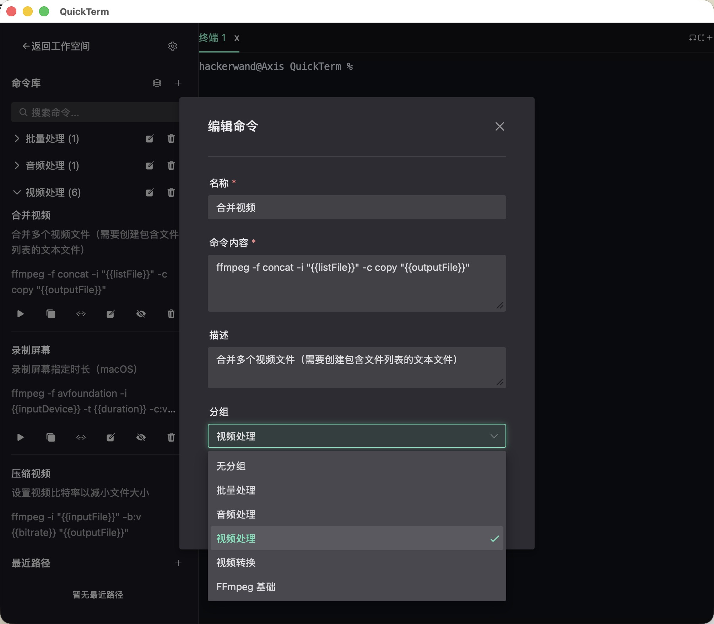

# QuickTerm

  

> 便捷命令管理终端工具

## 项目特色

QuickTerm 是一款专注于**命令管理**的现代化跨平台终端工具，为开发者提供高效、便捷的终端使用体验。

- **命令自动保存**：执行的命令自动保存到命令库，无需手动记录，可通过忽略命令（支持普通字符串和正则表达式）避免保存不需要的命令
- **快捷编辑**：支持快速编辑命令并立即执行，无需重新输入
- **参数模版**：支持预设参数，方便重复使用，也可自定义包括数字、选项、路径等参数，实现命令的参数化执行
- **最近路径管理**：快速访问常用路径，提高工作效率
- **预设工作空间模板**：涵盖多种开发场景，快速上手
- **灵活分屏**：支持多标签页和自由分屏，充分利用屏幕空间
- **工作空间隔离**：不同项目使用独立的命令库，避免命令混淆，并支持指定默认工作目录

## 差异亮点

与普通终端和其他终端工具相比，QuickTerm 的独特之处在于：

| 特性 | QuickTerm | 普通终端 | 其他终端工具 |
|------|-----------|----------|------------|
| 命令自动保存 | ✅ | ❌ | ❌ |
| 命令库管理 | ✅ | ❌ | ❌ |
| 命令分组 | ✅ | ❌ | ❌ |
| 命令忽略规则 | ✅ | ❌ | ❌ |
| 快捷编辑 | ✅ | ❌ | ❌ |
| 参数模版 | ✅ | ❌ | ❌ |
| 工作空间隔离 | ✅ | ❌ | ❌ |
| 最近路径管理 | ✅ | ❌ | 部分支持 |
| 灵活分屏 | ✅ | 部分支持 | 部分支持 |

## 解决的痛点

### 开发中的命令困扰
- **重复输入**：相同的命令需要反复输入，效率低下
- **复杂命令**：长命令、复杂命令难以记忆和准确输入
- **命令管理**：缺乏有效的命令组织和管理方式
- **环境切换**：不同项目需要不同的命令集，切换困难
- **命令历史**：终端历史命令查找不便，容易丢失

### QuickTerm 的解决方案
- **自动保存**：执行的命令自动保存，无需手动记录
- **命令库**：集中管理所有命令，分组分类，快速查找
- **工作空间**：不同项目使用不同工作空间，命令隔离管理
- **快捷执行**：点击即可执行保存的命令，告别重复输入
- **忽略规则**：过滤不需要保存的命令，保持命令库整洁
- **最近路径**：快速访问常用路径，提高工作效率

## 核心能力

### 命令库管理

- **自动保存**：终端执行的命令自动保存，无需手动记录
- **自动去重**：相同命令自动去重，保持命令库整洁
- **命令分组**：将命令按类别分组管理，便于快速查找
- **忽略规则**：可设置忽略模式（支持普通字符串和正则表达式），避免保存不需要的命令
- **快捷编辑**：支持快速编辑命令并立即执行，无需重新输入
- **一键执行**：点击即可执行保存的命令，告别重复输入
- **参数模版**：支持预设参数，方便重复使用，也可自定义包括数字、选项、路径等参数，实现命令的参数化执行

### 工作空间管理
- **工作空间选择器**：启动时显示所有可用工作空间，快速切换项目
- **独立命令库**：每个工作空间拥有独立的命令库，项目间命令互不干扰
- **路径管理**：为每个工作空间设置默认路径，终端启动自动进入
- **忽略规则隔离**：不同工作空间可设置不同的命令忽略规则

### 终端功能
- **多标签页**：每个分屏支持多个终端标签页，方便多任务操作
- **灵活分屏**：支持垂直和水平分屏，支持嵌套分屏，充分利用屏幕空间
- **终端模拟器**：基于 xterm.js，支持完整的终端功能和 ANSI 转义序列
- **标签管理**：添加、删除标签页，标签页关闭前确认，避免误操作
- **拖拽调整分屏**：通过分隔线调整分屏比例，灵活布局
- **独立终端进程**：每个终端对应独立伪终端进程，确保稳定性

### 最近路径管理
- **拖拽添加**：支持拖拽文件或目录到窗口自动添加路径
- **自动去重**：最多保存 20 条记录，保持列表整洁
- **快捷复制**：点击路径即可复制到剪贴板，无需手动选择
- **路径显示优化**：长路径自动截断，悬停显示完整路径，美观实用

## 工作空间模板

QuickTerm 提供了多种预设的工作空间模板，方便不同领域的用户快速上手。

### 可用模板

| 模板名称 | 描述 | 文件路径 |
|---------|------|----------|
| 自媒体视频编辑 | 包含 FFmpeg 常用命令，适用于视频处理 | [workspace-templates/ffmpeg.json](workspace-templates/ffmpeg.json) |
| 前端开发 | 包含前端开发常用命令，如 npm、Vue 等 | [workspace-templates/frontend.json](workspace-templates/frontend.json) |
| Go 后端开发 | 包含 Go 开发常用命令，如 go mod、go test 等 | [workspace-templates/go-backend.json](workspace-templates/go-backend.json) |
| DevOps/SysAdmin | 包含系统管理和 Docker 相关命令 | [workspace-templates/devops.json](workspace-templates/devops.json) |
| 数据科学 | 包含 Python 数据科学相关命令 | [workspace-templates/data-science.json](workspace-templates/data-science.json) |
| Git 版本控制 | 包含 Git 常用命令，如分支管理、远程仓库等 | [workspace-templates/git.json](workspace-templates/git.json) |
| 图片处理 | 包含 exiftool、ImageMagick 等图片处理工具的常用命令 | [workspace-templates/image-processing.json](workspace-templates/image-processing.json) |
| 网络管理与安全 | 包含网络诊断、安全扫描、API 测试等网络相关命令 | [workspace-templates/network-security.json](workspace-templates/network-security.json) |
| 数据库管理 | 包含 MySQL、PostgreSQL、MongoDB、Redis 等数据库管理命令 | [workspace-templates/database.json](workspace-templates/database.json) |
| 容器与云服务 | 包含 Docker、Kubernetes、AWS、Google Cloud 等容器和云服务命令 | [workspace-templates/container-cloud.json](workspace-templates/container-cloud.json) |
| 文本处理 | 包含 grep、sed、awk 等文本处理工具的常用命令 | [workspace-templates/text-processing.json](workspace-templates/text-processing.json) |
| 音频处理 | 包含 ffmpeg、sox 等音频处理工具的常用命令 | [workspace-templates/audio-processing.json](workspace-templates/audio-processing.json) |
| 系统维护与监控 | 包含系统资源监控、磁盘管理、进程管理等系统维护命令 | [workspace-templates/system-monitoring.json](workspace-templates/system-monitoring.json) |
| 文件管理与备份 | 包含文件同步、归档、查找、权限管理等文件操作命令 | [workspace-templates/file-management.json](workspace-templates/file-management.json) |

### 使用方法

1. 选择适合您的工作空间模板
2. 在 QuickTerm 中选择「导入工作空间」
3. 选择对应的 JSON 文件
4. 设置工作空间路径
5. 完成导入后即可使用模板中的命令

## 技术栈

### 前端
- **Vue 3** + **TypeScript**：现代化前端框架，类型安全
- **Naive UI**：美观的 UI 组件库，深色主题适配
- **xterm.js**：功能强大的终端模拟器
- **Vite**：快速的前端构建工具
- **Pinia**：状态管理库，管理应用状态

### 后端
- **Go**：高性能后端语言
- **Wails**：跨平台桌面应用框架
- **creack/pty**：跨平台伪终端管理
- **SQLite**：轻量级本地数据库

### 数据存储
- **SQLite**：本地文件型数据库，用于存储工作空间、命令、最近路径等数据

## 项目架构

### 前端架构
- **组件化设计**：各功能模块独立组件，便于维护和扩展
- **状态管理**：使用 Pinia 管理工作空间、命令、最近路径、终端状态
- **路由管理**：使用 Vue Router 管理页面路由
- **类型安全**：完整的 TypeScript 类型定义，减少错误

### 后端架构
- **Wails 绑定**：自动生成前端可调用的 Go 函数，类型安全
- **伪终端管理**：创建和管理伪终端进程，处理终端输入输出
- **数据库操作**：SQLite 数据库封装，处理数据持久化
- **事件通信**：前后端事件通信机制，实现实时数据同步

### 数据结构
- **工作空间**：包含名称、路径、忽略命令规则
- **命令**：包含名称、内容、描述、分组ID、工作空间ID
- **命令分组**：包含名称、工作空间ID
- **最近路径**：包含路径、位置排序

## 贡献

欢迎贡献代码、报告问题或提出建议！

## 许可证

本项目采用 MIT 许可证 - 详情请参阅 [LICENSE](LICENSE) 文件。

---

**QuickTerm** - 让命令管理更便捷，让终端操作更高效！